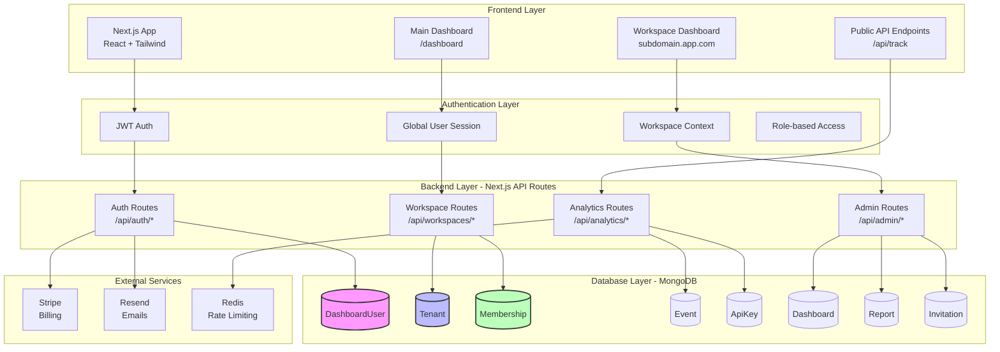
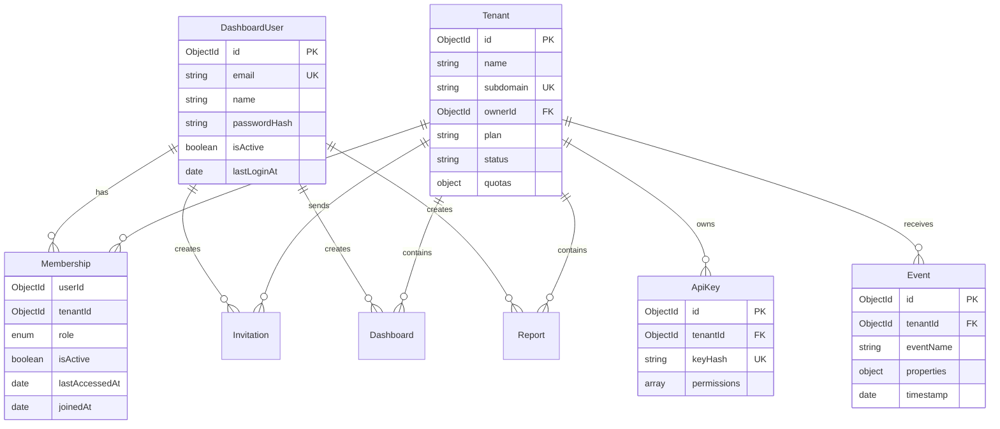
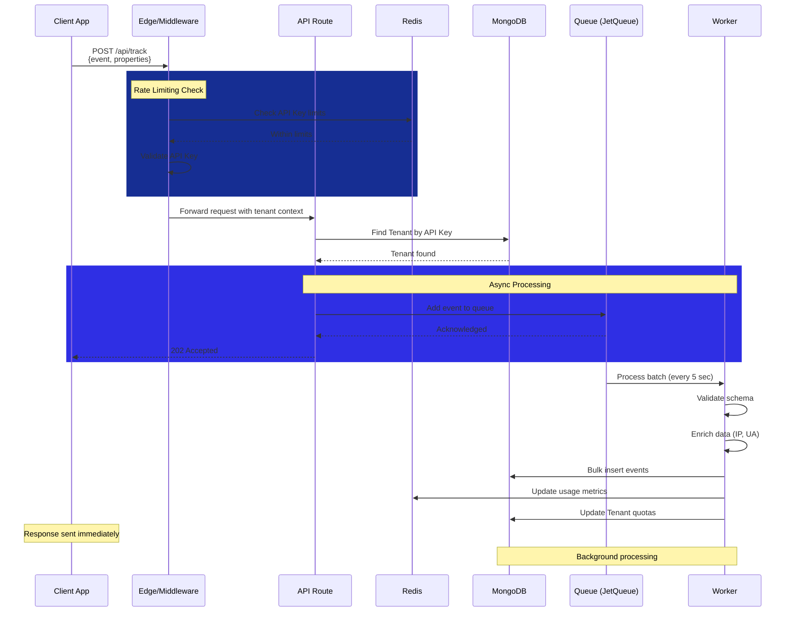
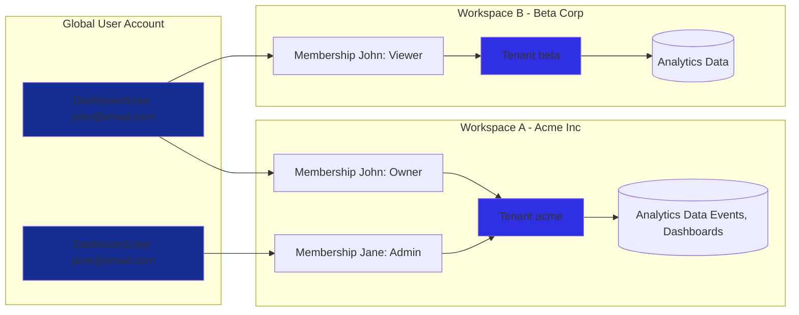
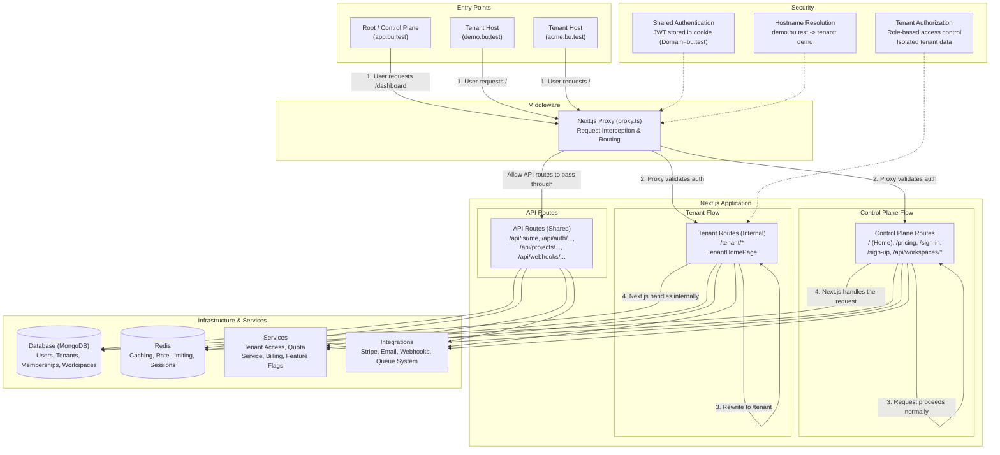

# Blu Architecture

## System Overview Diagram

## User Authentication Flow

```mermaid
sequenceDiagram
    participant U as User
    participant F as Frontend
    participant A as Auth API
    participant DB as MongoDB
    participant J as JWT Service

    rect rgb(0, 0, 0)
        Note over U,J: SIGN UP FLOW
        U->>F: Enter email, name, password
        F->>A: POST /api/auth/signup
        A->>DB: Check if email exists
        DB-->>A: User not found
        A->>DB: Create DashboardUser
        DB-->>A: User created
        A->>J: Generate JWT (global)
        J-->>A: Token
        A-->>F: {token, user}
        F-->>U: Redirect to /dashboard
    end

    rect rgb(0, 0, 0)
        Note over U,J: SIGN IN FLOW
        U->>F: Enter email, password
        F->>A: POST /api/auth/signin
        A->>DB: Find user by email
        DB-->>A: User found
        A->>A: Verify password
        A->>DB: Get memberships
        DB-->>A: List of workspaces
        A->>J: Generate JWT
        J-->>A: Token
        A-->>F: {token, user, workspaces}
        F-->>U: Show workspace selector
    end
```

## Workspace Management Flow

```mermaid
flowchart TD
    Start([User Authenticated]) --> Check{Has Workspaces?}

    Check -->|No| CreateFirst[Show Empty State]
    CreateFirst --> CreateWorkspace[Create Workspace Form]
    CreateWorkspace --> ValidateSubdomain{Check Subdomain<br/>Availability}

    ValidateSubdomain -->|Taken| ShowError[Show Error Message]
    ShowError --> CreateWorkspace

    ValidateSubdomain -->|Available| CreateTenant[Create Tenant]
    CreateTenant --> CreateMembership[Create Membership<br/>Role: Owner]
    CreateMembership --> GenerateJWT[Generate JWT with<br/>Tenant Context]
    GenerateJWT --> RedirectSubdomain[Redirect to<br/>workspace.app.com]

    Check -->|Yes| ShowWorkspaces[Show Workspace Cards]
    ShowWorkspaces --> UserAction{User Action}

    UserAction -->|Select Workspace| SwitchWorkspace[Switch Workspace]
    SwitchWorkspace --> UpdateJWT[Update JWT Context]
    UpdateJWT --> RedirectSelected[Redirect to Selected<br/>Workspace]

    UserAction -->|Create New| CreateWorkspace
    UserAction -->|Join via Invite| AcceptInvite[Accept Invitation]
    AcceptInvite --> CreateMembership2[Create Membership<br/>With Invited Role]
    CreateMembership2 --> RedirectInvited[Redirect to<br/>Workspace]

    RedirectSubdomain --> Dashboard([Workspace Dashboard])
    RedirectSelected --> Dashboard
    RedirectInvited --> Dashboard

    style Start fill:#2b2b2b
    style Dashboard fill:#162E93
    style CreateTenant fill:#1A1953
    style CreateMembership fill:#1A1953
```

## Data Model Relationships

## Request Flow for Analytics Tracking

## Multi-Workspace Architecture

## Tenancy Flow (technical)

