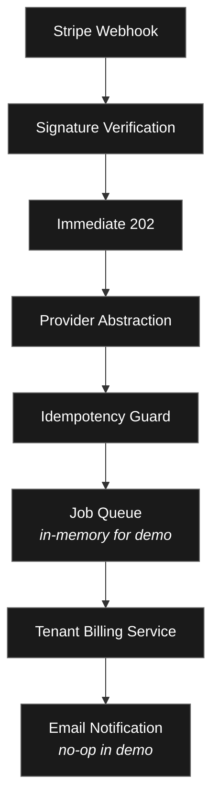

# SaaSify - Billing System Overview

The billing system is built around **Stripe webhooks** and a **clean separation of concerns**.
It receives events from Stripe, verifies their authenticity, processes them exactly once, and updates your multi‑tenant SaaS data model (Tenant) accordingly.
All heavy work is deferred to a background queue, so the webhook endpoint always responds immediately with `202 Accepted`.

## Architecture

## Key Design Decisions

- **Provider Abstraction** – Stripe is encapsulated behind a `PaymentProvider` interface. Adding Paddle or another provider later only requires a new adapter.
- **Idempotency with MongoDB** – Every event is recorded in a `ProcessedWebhooks` collection with a 24‑hour TTL. Duplicate events are automatically ignored.
- **Queue Adapter Pattern** – The webhook route uses a `QueueAdapter` to enqueue jobs. The demo uses an in‑memory implementation with retries. Switching to JetQueue in production requires no changes outside the adapter.
- **Tenant‑First Updates** – All billing logic reads and writes to the `Tenant` model. Quotas, plan, and status are updated atomically.

## Core Components

| Component | Responsibility |
|-----------|----------------|
| `PaymentProvider` | Signature verification, event parsing |
| `MongoIdempotencyStore` | Prevents double‑processing |
| `QueueAdapter` | Defers work to background |
| `TenantBillingService` | Handles all Stripe event types and updates the database |
| `EmailService` | Sends transactional emails (no‑op in demo) |
| Webhook route | Receives raw body, verifies, enqueues |

For details on each part, see the specific guides.
